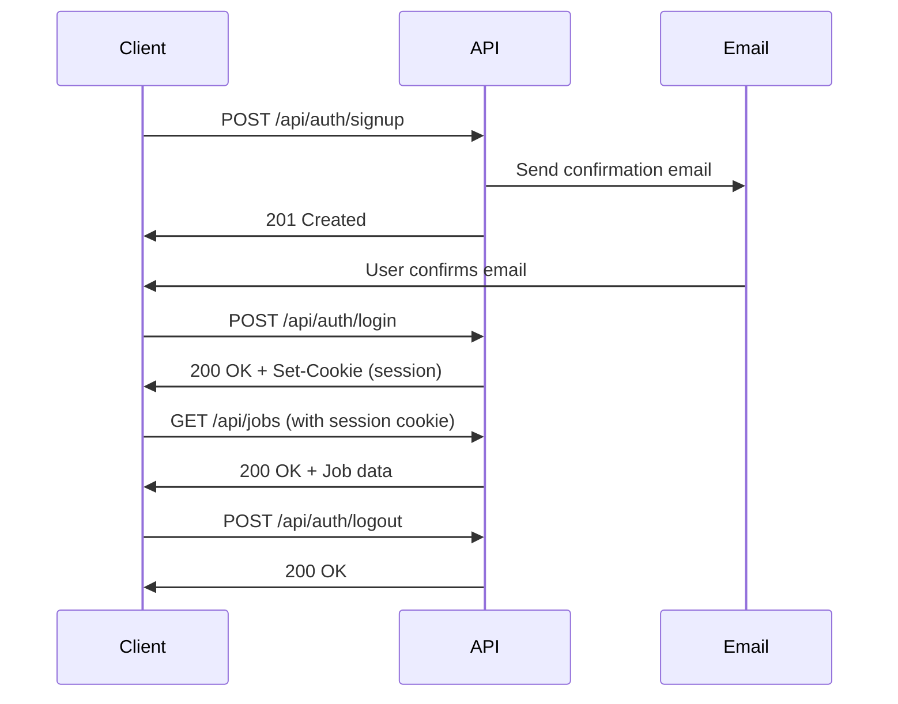

## Overview

The Pipeline API uses JWT (JSON Web Token) based authentication. After signing up and logging in, you'll receive a session token that must be included in the `Authorization` header for all authenticated requests.

## Authentication Flow

The typical authentication flow follows these steps:

1. **Signup** - Create a new account with email and password
2. **Email Confirmation** - Confirm your email address (check your inbox)
3. **Login** - Sign in to receive a session token
4. **Make Authenticated Requests** - Include the token in subsequent API calls
5. **Logout** - End your session when done



## Signup

Create a new account by providing an email and password.

### Endpoint

```
POST /api/auth/signup
```

### Request Body

<ParamField body="email" type="string" required>
  Valid email address (will be normalized to lowercase)
</ParamField>

<ParamField body="password" type="string" required>
  Password meeting security requirements (minimum 8 characters recommended)
</ParamField>

<ParamField body="redirect_to" type="string">
  Custom URL to redirect to after email confirmation (optional)
</ParamField>

### Response

<ResponseField name="user" type="object">
  Created user object
  
  <ResponseField name="user.id" type="string">
    Unique user identifier (UUID)
  </ResponseField>
  
  <ResponseField name="user.email" type="string">
    User's email address
  </ResponseField>
</ResponseField>

<ResponseField name="message" type="string">
  Instructions for next steps (e.g., "Check your email to confirm your account")
</ResponseField>

### Example

<CodeGroup>
```bash cURL
curl -X POST https://api.pipeline.local/api/auth/signup \
  -H "Content-Type: application/json" \
  -d '{
    "email": "user@example.com",
    "password": "SecureP@ssw0rd!"
  }'
```

```javascript JavaScript
const response = await fetch('https://api.pipeline.local/api/auth/signup', {
  method: 'POST',
  headers: {
    'Content-Type': 'application/json',
  },
  body: JSON.stringify({
    email: 'user@example.com',
    password: 'SecureP@ssw0rd!',
  }),
});

const data = await response.json();
console.log(data);
```

```python Python
import requests

response = requests.post(
    'https://api.pipeline.local/api/auth/signup',
    json={
        'email': 'user@example.com',
        'password': 'SecureP@ssw0rd!'
    }
)

print(response.json())
```
</CodeGroup>

### Success Response (201)

```json
{
  "user": {
    "id": "550e8400-e29b-41d4-a716-446655440000",
    "email": "user@example.com"
  },
  "message": "Check your email to confirm your account"
}
```

### Error Responses

<AccordionGroup>
  <Accordion title="400 - Validation Error">
    ```json
    {
      "error": {
        "code": "VALIDATION_ERROR",
        "message": "Invalid input",
        "details": [
          {
            "field": "email",
            "message": "Invalid email address"
          }
        ]
      }
    }
    ```
  </Accordion>
  
  <Accordion title="400 - Weak Password">
    ```json
    {
      "error": {
        "code": "WEAK_PASSWORD",
        "message": "Password does not meet security requirements."
      }
    }
    ```
  </Accordion>
  
  <Accordion title="409 - Email Already Exists">
    ```json
    {
      "error": {
        "code": "EMAIL_TAKEN",
        "message": "An account with this email already exists."
      }
    }
    ```
  </Accordion>
  
  <Accordion title="429 - Rate Limited">
    ```json
    {
      "error": {
        "code": "RATE_LIMITED",
        "message": "Too many signup attempts. Please try again later."
      }
    }
    ```
  </Accordion>
</AccordionGroup>

## Login

Sign in with your email and password to obtain a session token.

### Endpoint

```
POST /api/auth/login
```

### Request Body

<ParamField body="email" type="string" required>
  Your email address
</ParamField>

<ParamField body="password" type="string" required>
  Your password
</ParamField>

### Response

<ResponseField name="user" type="object">
  Authenticated user object
  
  <ResponseField name="user.id" type="string">
    User identifier (UUID)
  </ResponseField>
  
  <ResponseField name="user.email" type="string">
    User's email address
  </ResponseField>
</ResponseField>

<Note>
  **Session Management**: The API automatically sets secure, HTTP-only cookies containing your session token. You don't need to manually extract or store tokens - just include credentials in subsequent requests and cookies will be sent automatically.
</Note>

### Example

<CodeGroup>
```bash cURL
curl -X POST https://api.pipeline.local/api/auth/login \
  -H "Content-Type: application/json" \
  -c cookies.txt \
  -d '{
    "email": "user@example.com",
    "password": "SecureP@ssw0rd!"
  }'
```

```javascript JavaScript (with cookies)
const response = await fetch('https://api.pipeline.local/api/auth/login', {
  method: 'POST',
  headers: {
    'Content-Type': 'application/json',
  },
  credentials: 'include', // Important: include cookies
  body: JSON.stringify({
    email: 'user@example.com',
    password: 'SecureP@ssw0rd!',
  }),
});

const data = await response.json();
console.log(data);
```

```python Python (with session)
import requests

session = requests.Session()

response = session.post(
    'https://api.pipeline.local/api/auth/login',
    json={
        'email': 'user@example.com',
        'password': 'SecureP@ssw0rd!'
    }
)

print(response.json())
# Session cookies are automatically stored in the session object
```
</CodeGroup>

### Success Response (200)

```json
{
  "user": {
    "id": "550e8400-e29b-41d4-a716-446655440000",
    "email": "user@example.com"
  }
}
```

### Error Responses

<AccordionGroup>
  <Accordion title="401 - Invalid Credentials">
    ```json
    {
      "error": {
        "code": "INVALID_CREDENTIALS",
        "message": "Invalid email or password"
      }
    }
    ```
  </Accordion>
  
  <Accordion title="403 - Email Not Confirmed">
    ```json
    {
      "error": {
        "code": "EMAIL_NOT_CONFIRMED",
        "message": "Please confirm your email before logging in"
      }
    }
    ```
  </Accordion>
</AccordionGroup>

## Making Authenticated Requests

After logging in, include your session token in the `Authorization` header for all protected endpoints.

### Using Bearer Token

If you're managing tokens manually (e.g., from a custom auth implementation):

```bash
curl -X GET https://api.pipeline.local/api/jobs \
  -H "Authorization: Bearer YOUR_JWT_TOKEN_HERE"
```

### Using Session Cookies (Recommended)

When using the standard login flow, cookies are handled automatically:

<CodeGroup>
```bash cURL
# Use -b to send cookies from login
curl -X GET https://api.pipeline.local/api/jobs \
  -b cookies.txt
```

```javascript JavaScript
// Include credentials to send cookies automatically
const response = await fetch('https://api.pipeline.local/api/jobs', {
  credentials: 'include',
});

const data = await response.json();
```

```python Python
# Session object automatically handles cookies
response = session.get('https://api.pipeline.local/api/jobs')
print(response.json())
```
</CodeGroup>

## Logout

End your session and invalidate the authentication token.

### Endpoint

```
POST /api/auth/logout
```

### Headers

<ParamField header="Authorization" type="string" required>
  Bearer token or session cookie from login
</ParamField>

### Response

<ResponseField name="success" type="boolean">
  Always `true` on successful logout
</ResponseField>

### Example

<CodeGroup>
```bash cURL
curl -X POST https://api.pipeline.local/api/auth/logout \
  -b cookies.txt
```

```javascript JavaScript
const response = await fetch('https://api.pipeline.local/api/auth/logout', {
  method: 'POST',
  credentials: 'include',
});

const data = await response.json();
console.log(data); // { success: true }
```

```python Python
response = session.post('https://api.pipeline.local/api/auth/logout')
print(response.json()) # {'success': True}
```
</CodeGroup>

### Success Response (200)

```json
{
  "success": true
}
```

## Session Management

### Token Expiration

JWT tokens have a limited lifetime. When a token expires, you'll receive a `401 Unauthorized` response and need to log in again.

### Token Storage

<Warning>
  **Security Best Practice**: Session tokens are stored in secure, HTTP-only cookies to prevent XSS attacks. Never store tokens in localStorage or expose them to client-side JavaScript if possible.
</Warning>

### Handling Authentication Errors

When you receive a `401 Unauthorized` response:

1. Clear any stored session data
2. Redirect the user to the login page
3. After successful login, retry the original request

```javascript
async function fetchWithAuth(url, options = {}) {
  const response = await fetch(url, {
    ...options,
    credentials: 'include',
  });
  
  if (response.status === 401) {
    // Session expired - redirect to login
    window.location.href = '/login';
    return null;
  }
  
  return response.json();
}
```

## Rate Limits

Authentication endpoints have strict rate limits to prevent brute force attacks:

- **5 requests per minute per IP address**

If you exceed this limit, you'll receive a `429 Too Many Requests` response:

```json
{
  "error": {
    "code": "RATE_LIMIT_EXCEEDED",
    "message": "Too many requests. Please try again in 60 seconds.",
    "retry_after": 60
  }
}
```

## Error Codes Reference

| Code | HTTP Status | Description |
|------|-------------|-------------|
| `VALIDATION_ERROR` | 400 | Invalid request format or parameters |
| `INVALID_EMAIL` | 400 | Email address format is invalid |
| `WEAK_PASSWORD` | 400 | Password doesn't meet security requirements |
| `INVALID_CREDENTIALS` | 401 | Email or password is incorrect |
| `UNAUTHORIZED` | 401 | No valid session found |
| `EMAIL_NOT_CONFIRMED` | 403 | Account email not yet confirmed |
| `SIGNUPS_DISABLED` | 403 | New registrations temporarily disabled |
| `EMAIL_TAKEN` | 409 | Account with this email already exists |
| `RATE_LIMITED` | 429 | Too many authentication attempts |
| `INTERNAL_ERROR` | 500 | Unexpected server error |

## Security Considerations

<CardGroup cols={2}>
  <Card title="HTTPS Required" icon="shield">
    Always use HTTPS in production to protect credentials in transit
  </Card>
  
  <Card title="Secure Storage" icon="lock">
    Tokens are stored in HTTP-only cookies to prevent XSS attacks
  </Card>
  
  <Card title="Rate Limiting" icon="gauge">
    Brute force protection with IP-based rate limits
  </Card>
  
  <Card title="Email Normalization" icon="at">
    Emails are normalized to lowercase to prevent duplicates
  </Card>
</CardGroup>

## Next Steps

<CardGroup cols={2}>
  <Card title="Jobs API" icon="briefcase" href="/api/jobs">
    Start managing job applications with the Jobs API
  </Card>
  
  <Card title="API Overview" icon="book" href="/api/overview">
    Learn about request formats and error handling
  </Card>
</CardGroup>
