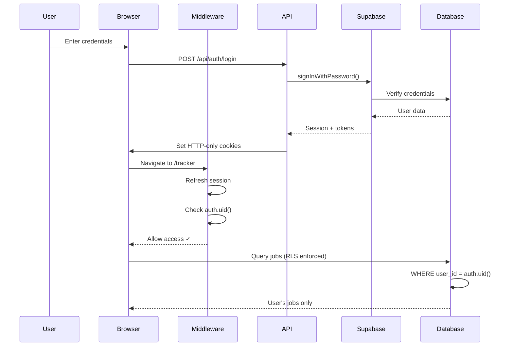

## Overview

Pipeline uses **Supabase Auth** for authentication with cookie-based sessions, Next.js middleware for route protection, and **Row-Level Security (RLS)** for data isolation.

<Info>
  All authentication is handled server-side with secure, HTTP-only cookies. No tokens are exposed to the client.
</Info>

---

## Authentication Architecture

### Auth Providers

<Card title="Supabase Auth" icon="key">
  Built-in authentication with email/password, social providers, and magic links
</Card>

**Supported Methods:**
- Email + Password (primary)
- Magic Links (email-based)
- OAuth providers (configurable)
- Email confirmation required

---

## Session Management

### Cookie-Based Sessions

Pipeline uses `@supabase/ssr` for automatic cookie-based session management:

<CodeGroup>
```typescript Client (Browser)
// src/lib/supabase/client.ts
import { createBrowserClient } from '@supabase/ssr';
import type { Database } from '@/src/lib/types/database.types';

export function createClient() {
  return createBrowserClient<Database>(
    process.env.NEXT_PUBLIC_SUPABASE_URL!,
    process.env.NEXT_PUBLIC_SUPABASE_ANON_KEY!
  );
}
```

```typescript Server (API Routes & RSC)
// src/lib/supabase/server.ts
import { createServerClient } from '@supabase/ssr';
import { cookies } from 'next/headers';

export async function createClient() {
  const cookieStore = await cookies();
  
  return createServerClient<Database>(
    process.env.NEXT_PUBLIC_SUPABASE_URL!,
    process.env.NEXT_PUBLIC_SUPABASE_ANON_KEY!,
    {
      cookies: {
        getAll() {
          return cookieStore.getAll();
        },
        setAll(cookiesToSet) {
          try {
            cookiesToSet.forEach(({ name, value, options }) =>
              cookieStore.set(name, value, options)
            );
          } catch (error) {
            // Server Components have read-only cookies
            // Errors are silently ignored in this context
          }
        },
      },
    }
  );
}
```

```typescript Admin Client (Service Role)
// Server-only admin client
export function createAdminClient() {
  return createServerClient<Database>(
    process.env.NEXT_PUBLIC_SUPABASE_URL!,
    process.env.SUPABASE_SERVICE_ROLE_KEY!,  // ⚠️ Never expose!
    {
      cookies: {
        getAll: () => [],
        setAll: () => {},
      },
    }
  );
}
```
</CodeGroup>

<Warning>
  The **service role key** bypasses RLS. Only use in trusted server-side code.
</Warning>

---

## Middleware & Route Protection

### Next.js Middleware

Middleware runs on **every request** to refresh sessions and protect routes.

<CodeGroup>
```typescript middleware.ts
import { createServerClient } from '@supabase/ssr';
import { NextResponse, type NextRequest } from 'next/server';

export async function middleware(request: NextRequest) {
  let supabaseResponse = NextResponse.next({ request });

  const supabase = createServerClient<Database>(
    process.env.NEXT_PUBLIC_SUPABASE_URL!,
    process.env.NEXT_PUBLIC_SUPABASE_ANON_KEY!,
    {
      cookies: {
        getAll() {
          return request.cookies.getAll();
        },
        setAll(cookiesToSet) {
          cookiesToSet.forEach(({ name, value }) =>
            request.cookies.set(name, value)
          );
          supabaseResponse = NextResponse.next({ request });
          cookiesToSet.forEach(({ name, value, options }) =>
            supabaseResponse.cookies.set(name, value, options)
          );
        },
      },
    }
  );

  // ⚠️ CRITICAL: Refresh session (don't remove!)
  const { data: { user } } = await supabase.auth.getUser();

  // Public routes (no auth required)
  const publicRoutes = [
    '/', '/login', '/signup', '/forgot-password',
    '/reset-password', '/auth/callback', '/api/auth'
  ];
  
  const pathname = request.nextUrl.pathname;
  const isPublicRoute = publicRoutes.some(route => {
    if (route === '/') return pathname === '/';
    return pathname.startsWith(route);
  });

  // Auth routes (redirect if already logged in)
  const authRoutes = ['/login', '/signup', '/forgot-password', '/reset-password'];
  const isAuthRoute = authRoutes.some(route => pathname.startsWith(route));

  // Redirect logic
  if (!user && !isPublicRoute) {
    // Not authenticated → redirect to login
    const url = request.nextUrl.clone();
    url.pathname = '/login';
    return NextResponse.redirect(url);
  }

  if (user && isAuthRoute) {
    // Authenticated → redirect to app
    const url = request.nextUrl.clone();
    url.pathname = '/tracker';
    return NextResponse.redirect(url);
  }

  return supabaseResponse;
}

export const config = {
  matcher: [
    '/((?!_next/static|_next/image|favicon.ico|.*\\.(?:svg|png|jpg|jpeg|gif|webp)$).*)',
  ],
};
```
</CodeGroup>

**Key Features:**
- Automatic session refresh on every request
- Redirects unauthenticated users to `/login`
- Redirects authenticated users away from auth pages
- Runs on all routes except static assets

---

## API Routes

### Login Endpoint

<CodeGroup>
```typescript POST /api/auth/login
import { NextRequest, NextResponse } from 'next/server';
import { createClient } from '@/src/lib/supabase/server';
import { z } from 'zod';

const LoginSchema = z.object({
  email: z.string().email('Invalid email address'),
  password: z.string().min(1, 'Password is required'),
});

export async function POST(request: NextRequest) {
  const body = await request.json();
  const { email: rawEmail, password } = LoginSchema.parse(body);
  
  // Normalize email (case-insensitive)
  const email = rawEmail.toLowerCase().trim();

  const supabase = await createClient();
  const { data, error } = await supabase.auth.signInWithPassword({
    email,
    password,
  });

  if (error) {
    if (error.message.includes('Email not confirmed')) {
      return NextResponse.json(
        { error: { code: 'EMAIL_NOT_CONFIRMED', message: 'Please confirm your email' } },
        { status: 403 }
      );
    }
    
    return NextResponse.json(
      { error: { code: 'INVALID_CREDENTIALS', message: 'Invalid email or password' } },
      { status: 401 }
    );
  }

  // ⚠️ Session cookies are set automatically by @supabase/ssr
  // Never return tokens in response body (XSS risk)
  return NextResponse.json({
    user: {
      id: data.user.id,
      email: data.user.email,
    },
  });
}
```

```typescript POST /api/auth/signup
import { SignupSchema } from '@/src/lib/validations/auth-schemas';

export async function POST(request: NextRequest) {
  const body = await request.json();
  const { email: rawEmail, password, redirect_to } = SignupSchema.parse(body);
  const email = rawEmail.toLowerCase().trim();

  const supabase = await createClient();
  const { data, error } = await supabase.auth.signUp({
    email,
    password,
    options: {
      emailRedirectTo: redirect_to ?? `${process.env.NEXT_PUBLIC_APP_URL}/auth/callback`,
    },
  });

  if (error) {
    // Sanitize error messages (don't leak internal details)
    return NextResponse.json(
      { error: { code: 'SIGNUP_FAILED', message: 'Unable to create account' } },
      { status: 400 }
    );
  }

  return NextResponse.json({
    user: { id: data.user?.id, email: data.user?.email },
    message: 'Check your email to confirm your account',
  });
}
```

```typescript POST /api/auth/logout
export async function POST() {
  const supabase = await createClient();
  await supabase.auth.signOut();

  return NextResponse.json({ success: true });
}
```
</CodeGroup>

---

## Row-Level Security (RLS)

### Overview

**RLS** ensures users can only access their own data. Policies are enforced at the **database level**, making them impossible to bypass from the application layer.

<Card title="RLS Enabled on All Tables" icon="shield-check">
  Every table has RLS enabled with policies for SELECT, INSERT, UPDATE, and DELETE operations.
</Card>

---

### Helper Functions

<CodeGroup>
```sql is_authenticated()
CREATE FUNCTION is_authenticated()
RETURNS BOOLEAN AS $$
BEGIN
  RETURN auth.uid() IS NOT NULL;
END;
$$ LANGUAGE plpgsql SECURITY DEFINER;
```

```sql is_service_role()
CREATE FUNCTION is_service_role()
RETURNS BOOLEAN AS $$
BEGIN
  RETURN (auth.jwt() ->> 'role') = 'service_role';
END;
$$ LANGUAGE plpgsql SECURITY DEFINER;
```

```sql owns_job()
CREATE FUNCTION owns_job(job_id UUID)
RETURNS BOOLEAN AS $$
DECLARE
  job_user_id UUID;
BEGIN
  SELECT user_id INTO job_user_id FROM jobs WHERE id = job_id;
  RETURN job_user_id = auth.uid();
END;
$$ LANGUAGE plpgsql SECURITY DEFINER;
```
</CodeGroup>

---

### Jobs Table Policies

<AccordionGroup>
  <Accordion title="users_view_own_jobs (SELECT)">
    ```sql
    CREATE POLICY "users_view_own_jobs" ON jobs
      FOR SELECT
      USING (
        auth.uid() = user_id
        AND deleted_at IS NULL
      );
    ```
    
    Users can **view** their own **active** jobs (not soft-deleted).
  </Accordion>

  <Accordion title="users_insert_own_jobs (INSERT)">
    ```sql
    CREATE POLICY "users_insert_own_jobs" ON jobs
      FOR INSERT
      WITH CHECK (auth.uid() = user_id);
    ```
    
    Users can **insert** jobs where they are the owner.
  </Accordion>

  <Accordion title="users_update_own_jobs (UPDATE)">
    ```sql
    CREATE POLICY "users_update_own_jobs" ON jobs
      FOR UPDATE
      USING (
        auth.uid() = user_id
        AND deleted_at IS NULL
      );
    ```
    
    Users can **update** their own **active** jobs.
  </Accordion>

  <Accordion title="users_delete_own_jobs (DELETE)">
    ```sql
    CREATE POLICY "users_delete_own_jobs" ON jobs
      FOR DELETE
      USING (
        auth.uid() = user_id
        AND deleted_at IS NULL
      );
    ```
    
    Users can **soft-delete** their own active jobs.
    
    <Warning>
      DELETE triggers the soft delete function, setting `deleted_at = NOW()` instead of hard-deleting.
    </Warning>
  </Accordion>

  <Accordion title="service_role_bypass_jobs (ALL)">
    ```sql
    CREATE POLICY "service_role_bypass_jobs" ON jobs
      FOR ALL
      USING (is_service_role())
      WITH CHECK (is_service_role());
    ```
    
    Service role key **bypasses RLS** for system operations (scrapers, AI scoring, analytics).
  </Accordion>
</AccordionGroup>

---

### Events Table Policies

<Tip>
  Events are **append-only**. Users can SELECT and INSERT their own events, but cannot UPDATE or DELETE.
</Tip>

<AccordionGroup>
  <Accordion title="users_view_own_events (SELECT)">
    ```sql
    CREATE POLICY "users_view_own_events" ON events
      FOR SELECT
      USING (auth.uid() = user_id);
    ```
  </Accordion>

  <Accordion title="users_insert_own_events (INSERT)">
    ```sql
    CREATE POLICY "users_insert_own_events" ON events
      FOR INSERT
      WITH CHECK (auth.uid() = user_id);
    ```
  </Accordion>

  <Accordion title="service_role_bypass_events (ALL)">
    ```sql
    CREATE POLICY "service_role_bypass_events" ON events
      FOR ALL
      USING (is_service_role())
      WITH CHECK (is_service_role());
    ```
  </Accordion>
</AccordionGroup>

---

## Security Best Practices

<CardGroup cols={2}>
  <Card title="Never Expose Service Role Key" icon="lock">
    The `SUPABASE_SERVICE_ROLE_KEY` bypasses RLS. Only use server-side with the `server-only` package.
  </Card>
  
  <Card title="HTTP-Only Cookies" icon="cookie">
    Session tokens are stored in HTTP-only cookies, inaccessible to JavaScript (prevents XSS).
  </Card>
  
  <Card title="Rate Limiting" icon="gauge">
    API routes implement rate limiting (5 req/min for auth endpoints).
  </Card>
  
  <Card title="Input Validation" icon="shield-check">
    All inputs validated with Zod schemas before database operations.
  </Card>
</CardGroup>

---

## Authentication Flow Diagram



---

## RLS Testing

### Manual Testing

<CodeGroup>
```sql Test User Isolation
-- Login as User A
SET request.jwt.claim.sub = 'user-a-uuid';

-- Try to access User B's job
SELECT * FROM jobs WHERE id = 'user-b-job-uuid';
-- Result: 0 rows (blocked by RLS)

-- Try to update User B's job
UPDATE jobs SET status = 'rejected' WHERE id = 'user-b-job-uuid';
-- Result: 0 rows affected (blocked by RLS)
```

```sql Test Service Role Bypass
-- Use service role key
SET request.jwt.claim.role = 'service_role';

-- Can access all jobs
SELECT COUNT(*) FROM jobs;
-- Result: All jobs across all users
```
</CodeGroup>

---

## Security Checklist

<Steps>
  <Step title="RLS Enabled">
    ✅ All tables have `ALTER TABLE ... ENABLE ROW LEVEL SECURITY`
  </Step>
  
  <Step title="Policies Defined">
    ✅ Every table has SELECT, INSERT, UPDATE policies (DELETE where appropriate)
  </Step>
  
  <Step title="Service Role Protected">
    ✅ `SUPABASE_SERVICE_ROLE_KEY` only in `.env` and server-side code with `server-only` package
  </Step>
  
  <Step title="Middleware Active">
    ✅ Session refresh on every request, route protection enforced
  </Step>
  
  <Step title="HTTPS URLs Only">
    ✅ Database constraint: `CHECK (job_url IS NULL OR job_url LIKE 'https://%')`
  </Step>
  
  <Step title="Input Validation">
    ✅ All API routes validate input with Zod schemas
  </Step>
</Steps>

---

## Next Steps

<CardGroup cols={2}>
  <Card title="Database Schema" href="/architecture/database-schema" icon="database">
    Review complete table structures and constraints
  </Card>
  <Card title="Deployment Guide" href="/architecture/deployment" icon="rocket">
    Deploy with RLS enabled to production
  </Card>
</CardGroup>