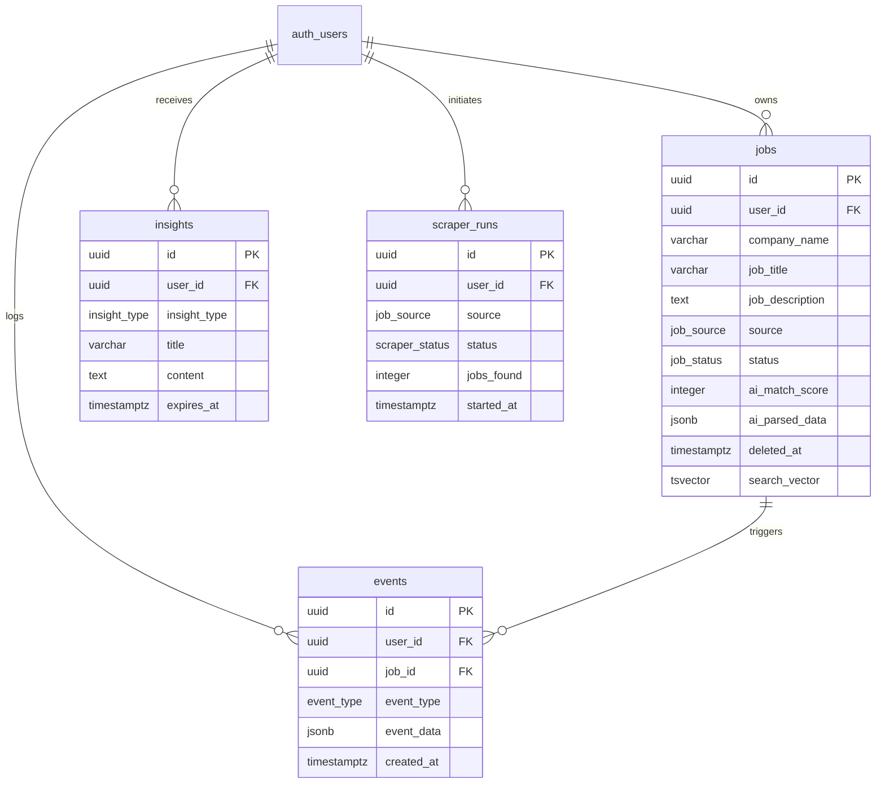
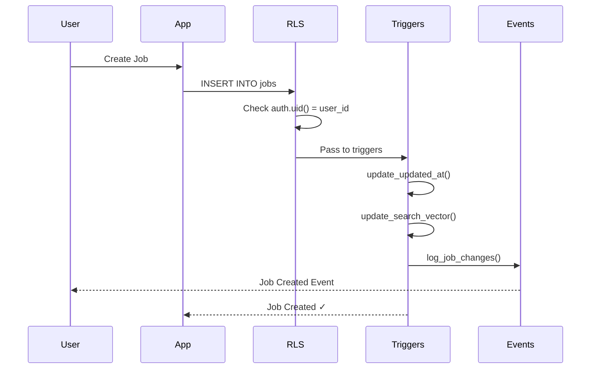
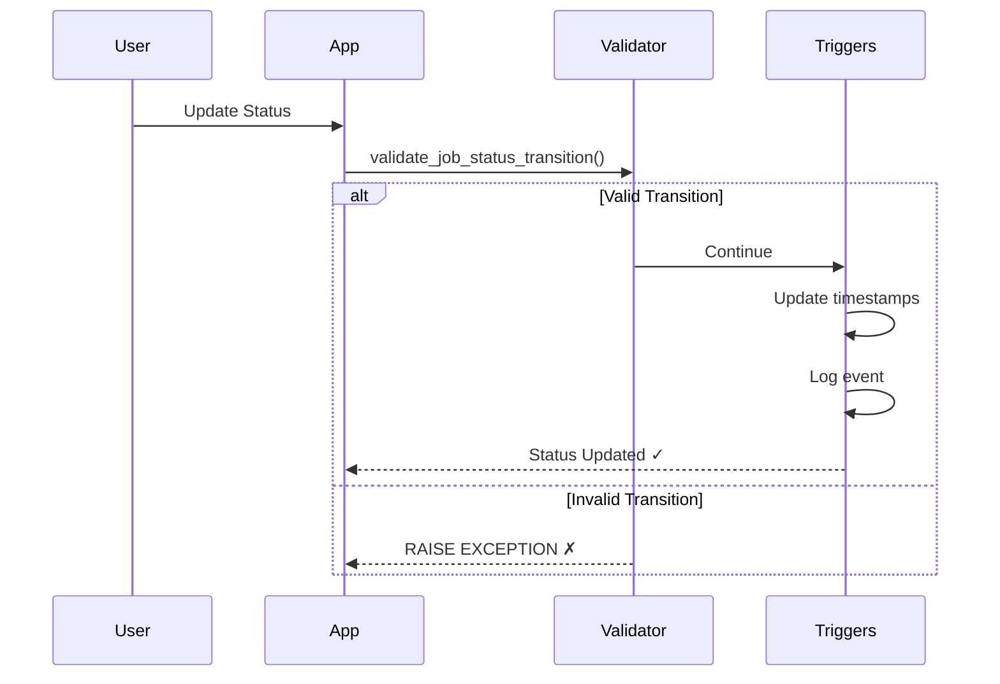

## Overview

Pipeline uses **Supabase (PostgreSQL 15+)** with a carefully designed schema featuring Row-Level Security (RLS), soft deletes, audit logging, and full-text search capabilities.

<Info>
  **Schema Version**: 1.0.20 (13 migrations applied)
  
  All migrations are located in `/supabase/migrations/`
</Info>

---

## Core Tables

### jobs

The main table storing all job applications and postings.

<ParamField path="id" type="UUID" default="gen_random_uuid()">
  Primary key - unique job identifier
</ParamField>

<ParamField path="user_id" type="UUID" required>
  Foreign key to `auth.users` - job owner
</ParamField>

<ParamField path="company_name" type="VARCHAR(200)" required>
  Company name (non-empty, max 200 chars)
</ParamField>

<ParamField path="job_title" type="VARCHAR(200)" required>
  Position title (non-empty, max 200 chars)
</ParamField>

<ParamField path="job_description" type="TEXT">
  Full job description (max 50,000 chars)
</ParamField>

<ParamField path="job_url" type="TEXT">
  HTTPS-only URL to original posting
</ParamField>

<ParamField path="source" type="job_source" required>
  One of: `brightermonday`, `fuzu`, `linkedin`, `manual`
</ParamField>

<ParamField path="status" type="job_status" default="'saved'">
  One of: `saved`, `applied`, `interview`, `offer`, `rejected`
</ParamField>

<ParamField path="ai_match_score" type="INTEGER">
  AI-calculated match percentage (0-100)
</ParamField>

<ParamField path="ai_parsed_data" type="JSONB">
  Structured data extracted by AI (skills, requirements)
</ParamField>

<ParamField path="ai_reasoning" type="TEXT">
  AI explanation for the match score
</ParamField>

<ParamField path="applied_at" type="TIMESTAMPTZ">
  Application submission date
</ParamField>

<ParamField path="interview_at" type="TIMESTAMPTZ">
  Interview start date
</ParamField>

<ParamField path="offer_at" type="TIMESTAMPTZ">
  Offer received date
</ParamField>

<ParamField path="rejected_at" type="TIMESTAMPTZ">
  Rejection date
</ParamField>

<ParamField path="notes" type="TEXT">
  User notes (max 10,000 chars)
</ParamField>

<ParamField path="tags" type="TEXT[]">
  Job tags (max 20 items, no empty strings)
</ParamField>

<ParamField path="salary_range_min" type="INTEGER">
  Minimum salary (≥ 30,000)
</ParamField>

<ParamField path="salary_range_max" type="INTEGER">
  Maximum salary (≤ 10,000,000)
</ParamField>

<ParamField path="location" type="VARCHAR(200)">
  Job location
</ParamField>

<ParamField path="is_remote" type="BOOLEAN" default="false">
  Remote job flag
</ParamField>

<ParamField path="created_at" type="TIMESTAMPTZ" default="NOW()">
  Creation timestamp
</ParamField>

<ParamField path="updated_at" type="TIMESTAMPTZ" default="NOW()">
  Last update timestamp (auto-updated)
</ParamField>

<ParamField path="deleted_at" type="TIMESTAMPTZ">
  Soft delete timestamp (NULL = active)
</ParamField>

<ParamField path="search_vector" type="tsvector">
  Weighted full-text search vector
</ParamField>

#### Check Constraints

- AI match score between 0-100
- Salary min ≤ max, min ≥ 30k, max ≤ 10M
- Applied date before interview date
- HTTPS-only URLs
- Non-empty company name and job title
- Max 20 tags, no empty strings

---

### events

Immutable activity log for audit trail (append-only).

<ParamField path="id" type="UUID" default="gen_random_uuid()">
  Primary key - unique event identifier
</ParamField>

<ParamField path="user_id" type="UUID" required>
  Foreign key to `auth.users` - event owner
</ParamField>

<ParamField path="job_id" type="UUID">
  Foreign key to `jobs` - related job (if applicable)
</ParamField>

<ParamField path="event_type" type="event_type" required>
  Event type enum (see Event Types below)
</ParamField>

<ParamField path="event_data" type="JSONB">
  Event payload (must be valid JSON object)
</ParamField>

<ParamField path="created_at" type="TIMESTAMPTZ" default="NOW()">
  Event timestamp
</ParamField>

<Warning>
  Events are **append-only**. No UPDATE or DELETE operations are allowed (enforced by RLS).
</Warning>

---

### insights

AI-generated insights and recommendations with expiry management.

<ParamField path="id" type="UUID" default="gen_random_uuid()">
  Primary key - unique insight identifier
</ParamField>

<ParamField path="user_id" type="UUID" required>
  Foreign key to `auth.users` - insight owner
</ParamField>

<ParamField path="insight_type" type="insight_type" required>
  One of: `daily_digest`, `pattern_detection`, `recommendation`, `weekly_summary`, `market_analysis`
</ParamField>

<ParamField path="title" type="VARCHAR(200)" required>
  Insight title (non-empty)
</ParamField>

<ParamField path="content" type="TEXT" required>
  Insight content (non-empty)
</ParamField>

<ParamField path="metadata" type="JSONB">
  Additional structured data
</ParamField>

<ParamField path="created_at" type="TIMESTAMPTZ" default="NOW()">
  Creation timestamp
</ParamField>

<ParamField path="expires_at" type="TIMESTAMPTZ">
  Expiry timestamp (must be in the future)
</ParamField>

---

### scraper_runs

Scraper telemetry and statistics for monitoring.

<ParamField path="id" type="UUID" default="gen_random_uuid()">
  Primary key - unique run identifier
</ParamField>

<ParamField path="user_id" type="UUID">
  Foreign key to `auth.users` - owner if manual run
</ParamField>

<ParamField path="source" type="job_source" required>
  Scraper source enum
</ParamField>

<ParamField path="status" type="scraper_status" required>
  One of: `running`, `completed`, `failed`, `cancelled`
</ParamField>

<ParamField path="started_at" type="TIMESTAMPTZ" default="NOW()">
  Run start timestamp
</ParamField>

<ParamField path="completed_at" type="TIMESTAMPTZ">
  Run completion timestamp
</ParamField>

<ParamField path="jobs_found" type="INTEGER" default="0">
  Total jobs found (≥ 0)
</ParamField>

<ParamField path="jobs_new" type="INTEGER" default="0">
  New jobs discovered (≥ 0)
</ParamField>

<ParamField path="jobs_imported" type="INTEGER" default="0">
  Jobs imported (≥ 0)
</ParamField>

<ParamField path="error_message" type="TEXT">
  Error details if failed
</ParamField>

<ParamField path="metadata" type="JSONB">
  Additional run data
</ParamField>

---

### audit_log

Comprehensive audit trail for compliance and debugging (system-managed).

<ParamField path="id" type="UUID" default="gen_random_uuid()">
  Primary key
</ParamField>

<ParamField path="table_name" type="TEXT" required>
  Affected table name
</ParamField>

<ParamField path="record_id" type="UUID" required>
  Affected record ID
</ParamField>

<ParamField path="operation" type="TEXT" required>
  One of: `INSERT`, `UPDATE`, `DELETE`
</ParamField>

<ParamField path="old_data" type="JSONB">
  Before snapshot
</ParamField>

<ParamField path="new_data" type="JSONB">
  After snapshot
</ParamField>

<ParamField path="user_id" type="UUID">
  Acting user
</ParamField>

<ParamField path="created_at" type="TIMESTAMPTZ" default="NOW()">
  Timestamp
</ParamField>

<Warning>
  Audit log is **service role only**. Regular users cannot access directly.
</Warning>

---

## Enums

### job_status

```sql
CREATE TYPE job_status AS ENUM (
  'saved',      -- Draft, not yet applied
  'applied',    -- Application submitted
  'interview',  -- Interview process started
  'offer',      -- Offer received
  'rejected'    -- Rejected or not selected
);
```

**Valid Status Transitions:**
- `saved` → `applied`, `rejected`
- `applied` → `interview`, `rejected`, `saved`
- `interview` → `offer`, `rejected`, `applied`, `interview`
- `offer` → `rejected`, `applied`, `saved`
- `rejected` → `saved`, `applied`

### job_source

```sql
CREATE TYPE job_source AS ENUM (
  'brightermonday',  -- BrighterMonday Kenya
  'fuzu',            -- Fuzu Kenya
  'linkedin',        -- LinkedIn
  'manual'           -- Manually entered
);
```

### event_type

```sql
CREATE TYPE event_type AS ENUM (
  'job_created',
  'status_changed',
  'ai_scored',
  'note_added',
  'application_sent',
  'interview_scheduled',
  'offer_received',
  'rejected',
  'gmail_auto_update',
  'calendar_event_created',
  'discord_command',
  'export_downloaded',
  'job_restored'  -- Added in migration 018
);
```

### insight_type

```sql
CREATE TYPE insight_type AS ENUM (
  'daily_digest',
  'pattern_detection',
  'recommendation',
  'weekly_summary',
  'market_analysis'
);
```

### scraper_status

```sql
CREATE TYPE scraper_status AS ENUM (
  'running',
  'completed',
  'failed',
  'cancelled'
);
```

---

## Indexes

### Performance Indexes

**jobs table:**
- `idx_jobs_user_status` - User's jobs by status
- `idx_jobs_user_created` - User's jobs by date (DESC)
- `idx_jobs_user_source` - User's jobs by source
- `idx_jobs_user_company` - User's companies
- `idx_jobs_search_weighted` - Full-text search (GIN)
- `idx_jobs_ai_match_score` - Top AI matches (DESC NULLS LAST)
- `idx_jobs_deleted_at` - Soft deleted jobs (partial index)

**events table:**
- `idx_events_user_created` - User's events by date (DESC)
- `idx_events_job_id` - Job's events
- `idx_events_user_type` - User's events by type

**insights table:**
- `idx_insights_user_id` - User's insights
- `idx_insights_created_at` - Recent insights (DESC)
- `idx_insights_expires_at` - Expiring insights (partial index)

**scraper_runs table:**
- `idx_scraper_runs_started_at` - Recent runs (DESC)
- `idx_scraper_runs_user_started` - User's runs by date

---

## Database Functions

### Full-Text Search

<CodeGroup>
```sql Weighted Search Function
CREATE FUNCTION search_jobs(
  search_query TEXT,
  max_results INTEGER DEFAULT 50
)
RETURNS TABLE (
  id UUID,
  company_name TEXT,
  job_title TEXT,
  rank REAL
);
```

```typescript Usage in TypeScript
const { data } = await supabase
  .rpc('search_jobs', {
    search_query: 'software engineer',
    max_results: 20
  });
```
</CodeGroup>

**Search Weights:**
- **A** (highest): `job_title`, `company_name`
- **B** (medium): `job_description`
- **C** (lowest): `tags`

### Soft Delete Utilities

<CodeGroup>
```sql Soft Delete
SELECT soft_delete_record('jobs', 'job-uuid-here');
```

```sql Restore Record
SELECT restore_record('jobs', 'job-uuid-here');
```

```sql Check if Deleted
SELECT is_record_deleted('jobs', 'job-uuid-here');
```
</CodeGroup>

### Cleanup Functions

```sql
-- Preview old deleted records (dry run)
SELECT * FROM cleanup_old_deleted_records(
  older_than_days := 30,
  dry_run := true
);

-- Actually delete old records
SELECT * FROM cleanup_old_deleted_records(
  older_than_days := 30,
  dry_run := false
);
```

---

## Triggers

### Automated Triggers

<AccordionGroup>
  <Accordion title="trigger_update_updated_at">
    **Table**: `jobs`
    
    **Event**: BEFORE UPDATE
    
    **Function**: `update_updated_at_column()`
    
    **Purpose**: Automatically updates `updated_at` timestamp on every job update
  </Accordion>

  <Accordion title="trigger_validate_status_transition">
    **Table**: `jobs`
    
    **Event**: BEFORE UPDATE
    
    **Function**: `validate_job_status_transition()`
    
    **Purpose**: Validates status changes follow allowed transition rules. Raises exception for invalid transitions.
  </Accordion>

  <Accordion title="trigger_log_job_changes">
    **Table**: `jobs`
    
    **Event**: AFTER INSERT OR UPDATE
    
    **Function**: `log_job_changes()`
    
    **Purpose**: Logs job changes to `events` table for audit trail
  </Accordion>

  <Accordion title="trigger_update_search_vector">
    **Table**: `jobs`
    
    **Event**: BEFORE INSERT OR UPDATE
    
    **Function**: `update_search_vector()`
    
    **Purpose**: Updates weighted full-text search vector for search functionality
  </Accordion>
</AccordionGroup>

---

## Entity Relationship Diagram



---

## Data Flow Examples

### Job Creation Flow



### Status Transition Flow



---

## Migration History

<Steps>
  <Step title="001_tables.sql">
    Core tables and enums
  </Step>
  <Step title="002_indexes.sql">
    Performance indexes
  </Step>
  <Step title="003_triggers.sql">
    Automated triggers
  </Step>
  <Step title="004_rls.sql">
    Row-Level Security policies
  </Step>
  <Step title="005_audit.sql">
    Audit logging system
  </Step>
  <Step title="006_soft_deletes.sql">
    Soft delete utilities
  </Step>
  <Step title="007-019">
    Bug fixes and security enhancements
  </Step>
</Steps>

---

## Next Steps

<CardGroup cols={2}>
  <Card title="RLS Policies" href="/architecture/authentication" icon="shield">
    Learn about Row-Level Security implementation
  </Card>
  <Card title="Deployment" href="/architecture/deployment" icon="rocket">
    Deploy database to production
  </Card>
</CardGroup>